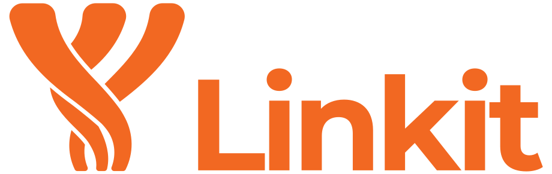

 (
counter since 3 march 2021)

  The Linkit Framework

  

Linkit is a high level networking framework in which exchanges between peers are fully object oriented.

The framework provides a naming system, the ability to implement caches synchronized with other remote engines,
and a whole system of object connection to create "inter-engine" objects in which methods calls are replicated to the
engines that uses the objects (RMI).
This object connection is the biggest part of the framework, and this system is fully customizable as you can impose a
contract to your objects in order to enhance your control on them

Learn more on the [Website](https://override-6.github.io/Linkit/) !
